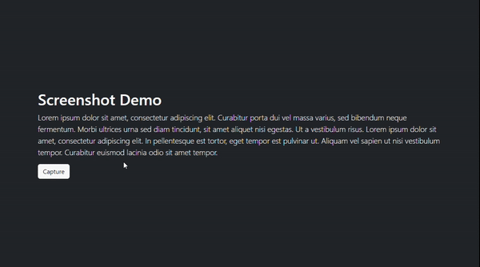

# ScreenshotJS
The module helps to take a screenshot in browsers.

## Demo


## Installation
```bash
npm install html2canvas screenshotjs -S
```

## Methods
### capture(options) -> void
Allows users to select an area to be screenshotted.

#### Parameters
| Name               | Type              | Description                                                |
|--------------------|-------------------|------------------------------------------------------------|
| options.onComplete | (dataUrl) => void | A callback called when the area of screenshot is selected. |

### download(dataUrl, filename) -> void
Downloads an image dataUrl to the local drive.

#### Parameters
| Name     | Type   | Description                       |
|----------|--------|-----------------------------------|
| dataUrl  | string | Image data in data url format     |
| filename | string | The filename of image data        |

## License
MIT
